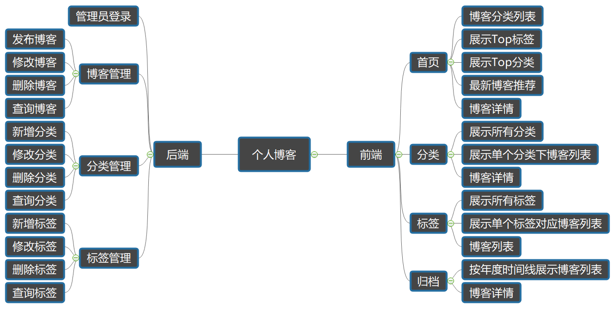

# SpringBoot开发的小型个人博客

​	*作者：吴泽涛*


## 1、需求与功能


### 1.1、用户故事

用户故事模板：

- As a (role of user)，I want (some feature) so that (some business value).
- 作为一个（某个角色）使用者，我可以做（某个功能）事情，如此可以有（某个商业价值）的好处

角色、功能、商业价值

举例：

- 作为一个招聘网站注册用户，我想查看最近3天发布的招聘信息，以便于了解最新的招聘信息。
- 作为公司，可以张贴新工作。


个人博客系统的用户故事：

角色：普通访客、管理员（我）

*`普通访客：`*

- 可以分页查看所有的博客
- 可以快速查看博客数最多的6个分类
- 可以查看所有分类
- 可以查看某个分类下的博客列表
- 可以快速查看标记博客最多的10个标签
- 可以查看所有标签
- 可以查看某个标签下的博客列表
- 可以根据年度时间线查看博客列表
- 可以快速查看最新的推荐博客
- 可以用关键字全局搜索博客
- 可以查看单个博客内容
- 可以对博客内容进行评论
- 可以赞赏博客内容
- 可以微信扫描阅读博客内容
- 可以在首页扫描公总号二维码关注我

*`我：`*

- 可以登录后台管理
- 可以管理博客
   -  可以发布新博客
  - 可以对博客进行分离
  - 可以对博客打标签
  - 可以修改博客
  - 可以删除博客
  - 可以根据标题、分类、标签查看博客
- 可以管理博客分类
  - 可以新增一个分类
  - 可以修改一个分类
  - 可以删除一个分类
  - 可以根据分类名称查询分类
- 可以管理标签
  - 可以新增一个标签
  - 可以修改一个标签
  - 可以删除一个标签
  - 可以根据名称查询标签


## 2、页面设计与开发


### 2.1、设计




前端展示：首页、详情页、分类页、标签页、归档页、个人简介页

后台管理：模板页


### 2.2、页面开发

[Semantic UI官网](https://semantic-ui.com/)

[Semantic UI中文官网](https://zijieke.com/semantic-ui/)

[WebStorm下载](https://www.jetbrains.com/webstorm/)

[背景图片资源](https://www.toptal.com/designers/subtlepatterns/)


### 2.3、插件集成

[编辑器Markdown](https://pandao.github.io/editor.md/)

[内容排板typo.css](https://github.com/sofish/typo.css)

[动画animate.css](https://daneden.github.io/animate.css/)

[代码高亮prism](https://github.com/PrismJS/prism)

[目录生成Tocbot](https://tscanlin.github.io/tocbot/)

[滚动侦测waypoints](http://imakewebthings.com/waypoints/)

[平滑滚动jquery.scrollTo](https://github.com/flesler/jquery.scrollTo)

[二维码生成qrcode.js](https://davidshimjs.github.io/qrcodejs/)


## 3、框架搭建

​	*IDEA下载：*https://www.jetbrains.com/idea/


### 3.1、构建与配置

1、引入SpringBoot模块：

- web
- Thymeleaf
- JPA
- MySQL
- Aspects
- DevTools


### 3.2、异常处理

1、定义错误页面

- 404
- 500
- error

2、全局处理异常


统一处理异常：

```java
//拦截所有标注了@Controller的类
@ControllerAdvice
public class ControllerExceptionHandler {

    private Logger logger = LoggerFactory.getLogger(this.getClass());

    //标识做异常处理的方法
    @ExceptionHandler(Exception.class)
    public ModelAndView exceptionHandler(HttpServletRequest request,Exception e) throws Exception{
        logger.error("Request URL : {}, Exception : {}", request.getRequestURL(),e);
        
        if(AnnotationUtils.findAnnotation(e.getClass(), ResponseStatus.class) != null){
            throw e;
        }
        
        ModelAndView view = new ModelAndView();
        view.addObject("url",request.getRequestURL());
        view.addObject("exception",e);
        view.setViewName("error/error");
        return view;
    }
}

```


错误页面异常信息显示处理：

```html
<div>
    <div th:utext="'&lt;!--'" th:remove="tag"></div>
    <div th:utext="'Failed Request URL : ' + ${url}" th:remove="tag"></div>
    <div th:utext="'Exception message : ' + ${exception.message}" th:remove="tag"></div>
    <ul th:remove="tag">
      <li th:each="st : ${exception.stackTrace}" th:remove="tag"><span th:utext="${st}" th:remove="tag"></span></li>
    </ul>
    <div th:utext="'--&gt;'" th:remove="tag"></div>
</div>
```


资源不存在异常：

```java
@ResponseStatus(HttpStatus.NOT_FOUND)
public class NotFoundException extends RuntimeException{
    public NotFoundException() {
        super();
    }

    public NotFoundException(String message) {
        super(message);
    }

    public NotFoundException(String message, Throwable cause) {
        super(message, cause);
    }
}

```


### 3.3、日志处理

1、记录日志内容

- 请求url
- 访问者ip
- 调用方法classMethod
- 参数args
- 返回内容


2、记录日志类

```java
@Aspect
@Component
public class LogAspect {

    private final Logger logger = LoggerFactory.getLogger(this.getClass());

    @Pointcut("execution(* com.coderwzt.web.*.*(..))")
    public void log(){}

    @Before("log()")
    public void doBefore(JoinPoint joinpoint){
        ServletRequestAttributes attributes = (ServletRequestAttributes) RequestContextHolder.getRequestAttributes();
        HttpServletRequest request = attributes.getRequest();
        String url = request.getRequestURL().toString();
        String ip = request.getRemoteAddr();
        String classMethod = joinpoint.getSignature().getDeclaringTypeName() + "." + joinpoint.getSignature().getName();
        Object[] args = joinpoint.getArgs();
        RequestLog requestLog = new RequestLog(url, ip, classMethod, args);

        logger.info("Request : {}",requestLog);
    }

    @After("log()")
    public void doAfter(){
        logger.info("-------After-------");
    }

    @AfterReturning(returning = "result",pointcut = "log()")
    public void doAfterReturn(Object result){
        logger.info("Result:" + result);
    }

    private class RequestLog{
        private String url;
        private String ip;
        private String ClassMethod;
        private Object[] args;

        public RequestLog(String url, String ip, String classMethod, Object[] args) {
            this.url = url;
            this.ip = ip;
            ClassMethod = classMethod;
            this.args = args;
        }

        @Override
        public String toString() {
            return "RequestLog{" + "url='" + url + '\'' + ", ip='" + ip + '\'' + ", ClassMethod='" + ClassMethod + '\'' + ", args=" + Arrays.toString(args) + '}';
        }
    }
}

```


### 3.4、页面处理

1、静态页面导入project

2、thymeleaf布局

- 定义fragment
- 使用fragment布局

3、错误页面美化


## 4、设计与规范


### 4.1、实体设计

实体类：

- 博客Blog
- 博客分类Type
- 博客标签Tag
- 博客评论Comment
- 用户User


实体关系：

+ Blog : Type	-->	n : 1
  + Blog : Tag       -->n : m
    + Blog : User-->n : 1
    + Blog : Comment-->1 : n


评论类自关联关系：

 + parentComment	-->	replyComment 	1 ：n
 + 一条评论有多个恢复


Blog类：

+ 属性：标题、内容、首图、标记、浏览次数、恰饭开启、版权开启、评论开启、发布、创建时间、更新时间
+ 关系实体类：分类、标签、评论、用户


Type类：

+ 属性：名称


Tag类：

+ 属性：名称


Comment类：

+ 属性：昵称、邮箱、头像、评论内容、创建时间


User类：

+ 属性：昵称、用户名、密码、邮箱、类型、头像、创建时间、更新时间


### 4.2、应用分层

+ 终端显示层
+ 请求处理层（Web层）
+ 业务逻辑层（Service层）
+ 持久层（Dao层）
+ 数据库


### 4.3、命名约定

Service/Dao层命名约定：

+ 获取单个对象的方法用get做前缀
+ 获取多个对象的方法用list做前缀
+ 获取统计值的方法用count做前缀
+ 插入的方法用save(推荐)或insert做前缀
+ 删除的方法用remove(推荐)或delete做前缀
+ 修改的方法用update做前缀


## 5、后台管理


### 5.1、登录


1、构建登录页面和后台管理页面

2、UserService和UserRepository

3、LoginController实现登录

4、MD5加密

5、登录拦截器


### 5.2、分类管理


1、分类管理页面

2、分类列表分页(Pageable)

```javascript
{
  "content":[
    {"id":123,"title":"blog122","content":"this is blog content"},
    {"id":122,"title":"blog121","content":"this is blog content"},
    {"id":121,"title":"blog120","content":"this is blog content"},
    {"id":120,"title":"blog119","content":"this is blog content"},
    {"id":119,"title":"blog118","content":"this is blog content"},
    {"id":118,"title":"blog117","content":"this is blog content"},
    {"id":117,"title":"blog116","content":"this is blog content"},
    {"id":116,"title":"blog115","content":"this is blog content"},
    {"id":115,"title":"blog114","content":"this is blog content"},
    {"id":114,"title":"blog113","content":"this is blog content"},
    {"id":113,"title":"blog112","content":"this is blog content"},
    {"id":112,"title":"blog111","content":"this is blog content"},
    {"id":111,"title":"blog110","content":"this is blog content"},
    {"id":110,"title":"blog109","content":"this is blog content"},
    {"id":109,"title":"blog108","content":"this is blog content"}],
    "last":false,
    "totalPages":9,
    "totalElements":123,
    "size":15,
    "number":0,
    "first":true,
    "sort":[{
    "direction":"DESC",
    "property":"id",
    "ignoreCase":false,
    "nullHandling":"NATIVE",
    "ascending":false
    }],
  "numberOfElements":15
}
```


3、分类新增、修改、删除


### 5.3、标签管理


### 5.4、博客管理

1、博客分页查询

2、博客新增

3、博客修改

4、博客删除


## 6、前端展示


### 6.1、博客展示

1、博客列表

2、top分类

3、top标签

4、最新博客推荐

5、博客详情

(1)Markdown 转化为 HTML

- commonmark-java https://github.com/atlassian/commonmark-java
- pom.xml引用commonmark和扩展插件

```xml
  <dependency>
      <groupId>com.atlassian.commonmark</groupId>
      <artifactId>commonmark</artifactId>
      <version>0.10.0</version>
  </dependency>
  <dependency>
      <groupId>com.atlassian.commonmark</groupId>
      <artifactId>commonmark-ext-heading-anchor</artifactId>
      <version>0.10.0</version>
  </dependency>
  <dependency>
      <groupId>com.atlassian.commonmark</groupId>
      <artifactId>commonmark-ext-gfm-tables</artifactId>
      <version>0.10.0</version>
  </dependency>
```


(2)评论功能

- 评论信息提交与恢复功能
- 评论信息列表展示功能
- 管理员回复评论功能

